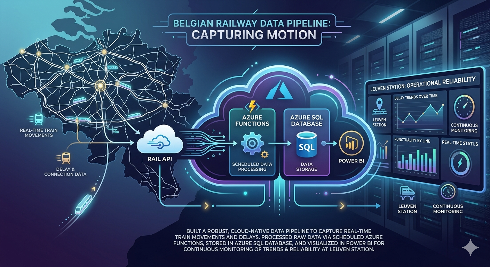
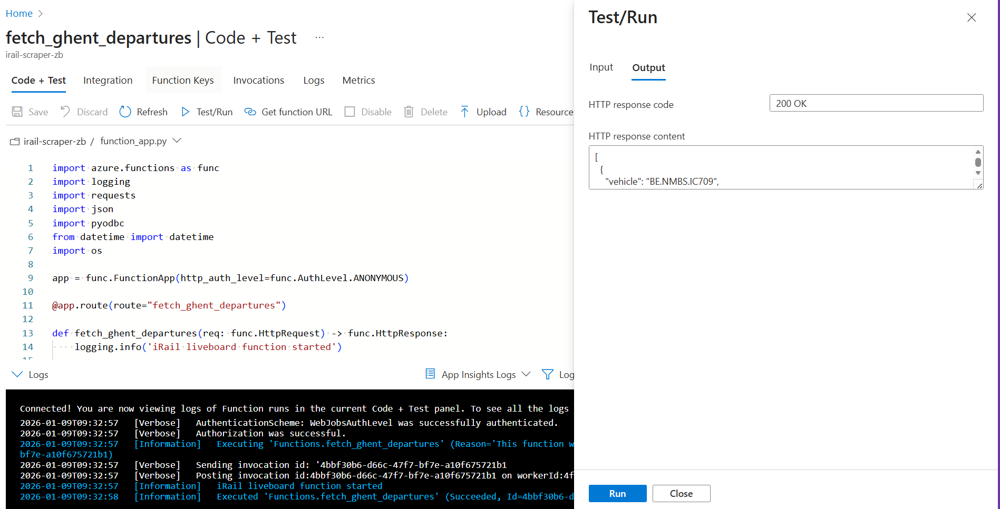
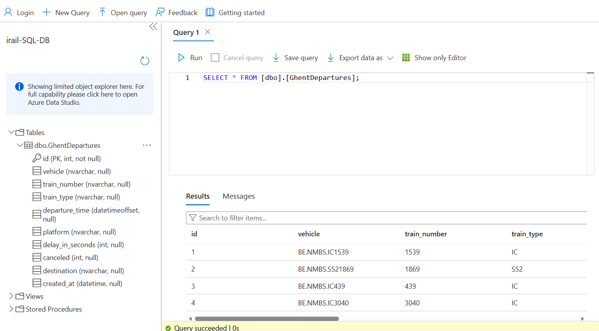

# iRail Data Engineering Pipeline - Leuven Station

## 📌 Project Overview

The Belgian railway network is a complex web of real-time movements, delays, and connections. This project focuses on building a robust, cloud-native data pipeline to capture this motion. By fetching live data from the [iRail API](https://docs.irail.be/), processing it via scheduled Azure Functions, and storing it in an Azure SQL Database, the system transforms raw transport streams into dynamic Power BI insights. This setup allows for continuous monitoring of delay trends and operational reliability at Leuven station without manual intervention.

---
## Installation

1. **Clone the project:**

```
    git clone https://github.com/butkutez/challenge-azure.git
    cd challenge-azure
```
2. **Create virtual environment (Windows)**
```
   python3.10 -m venv .venv
   .\.venv\Scripts\Activate.ps1
   ```

3. **Install dependencies**  
```
    pip install -r requirements.txt
```

4. **Run the Data Pipeline** 

To fetch live data from iRail and populate your database, run the following command in your terminal:

```
    func start
```
Once the host is running, open the provided **local URL** (check the terminal)  in your browser.

## Repo Structure

```
CHALLENGE-AZURE
├──assets
│   ├── Azure_Function_app_test.png
│   └── Azure_SQL_database.png
├── .funcignore                   
├── .gitignore
├── function_app.py
├── host.json        
├── README.md
├── requirements.txt
└── table_code.sql
```
***Note**: `local.settings.json` is excluded from this repo for security but is required for local execution.*

## Process & Methodology

```
┌─────────────┐       ┌──────────────────┐       ┌─────────────────┐       ┌──────────────┐
│  iRail API  │ ──►   │  Azure Function  │ ──►   │  Azure SQL DB   │ ──►   │   Power BI   │
│ /liveboard  │       │     (Python)     │       │ LeuvenDepartures│       │  Dashboard   │
└─────────────┘       └──────────────────┘       └─────────────────┘       └──────────────┘
   Raw JSON       Automated Cloud Data Pipeline      Stored Data             Live Insights
```
The development of this pipeline followed a structured approach to ensure data integrity and cloud compatibility.

I. **Data Source & Analysis**
I analyzed the iRail API structure, specifically the **liveboard** endpoint. Since the API returns deeply nested JSON, I identified the following key fields required for meaningful insights:

- ```vehicle & vehicleinfo```: For train identification and type.

- ```time```: Unix timestamp requiring conversion to SQL-friendly DATETIME.

- ```delay```: Integer values to track punctuality.

II. **Normalization Strategy**
Instead of importing a heavy library like Pandas, I opted for a lightweight manual normalization approach within the Azure Function.

- **Flattening**: I iterated through the departures list to extract nested values (like train_number from inside vehicleinfo).  
Code:  ```train.get("vehicleinfo", {}).get("number")```

- **Data Typing**: I ensured integers (delays/canceled status) and strings (destinations) were correctly typed before the SQL insertion.  
Code: ``` int(train.get("delay", 0))```, ```int(train.get("canceled", 0))``` and ```train.get("station")```

- **Transformation**: 
    - *Parsing*: I converted raw Unix timestamps (seconds since epoch) into Python datetime objects using ```datetime.fromtimestamp(ts)```.

    - *Serialization*: I then used ```dt.isoformat()``` to generate ISO 8601 strings. This is a critical step because while Python objects exist in memory, Azure SQL requires a standardized string format to correctly interpret and store data into DATETIME columns.

III. **Cloud Infrastructure Setup**  
The infrastructure was provisioned via the Azure Portal:
- **Azure SQL Database**: Created a serverless database and configured the Server-level Firewall to allow the Function App's IP address.

- **Function App (Timer Trigger)**: Transitioned the project from a manual HTTP trigger to a scheduled Timer Trigger using a CRON expression ```(0 */10 * * * *)```. This ensures the "Extract" and "Load" phases execute automatically every 10 minutes, maintaining a near-real-time dataset of Leuven station activity.

- **Security**: To avoid hardcoding credentials, I utilized Azure App Settings (Environment Variables) to store the SQL_AZURE_CONNECTION string.

IV. **Database Integration**  
To handle real-time data overlaps, I implemented a SQL MERGE (Upsert) strategy. Rather than performing a standard bulk insert which could lead to primary key violations or duplicate records, the pipeline evaluates each record:

- MATCHED: Existing records are updated with the latest ``delay``,  ``platform`` and ``canceled`` information.

- NOT MATCHED: New train departures are seamlessly inserted into the ``LeuvenDepartures`` table. This ensures the database remains a "Single Source of Truth" for station status, even across multiple scheduled scrapes.

## SQL Schema
To support the data being fetched, I created the following table in Azure SQL:

```sql
CREATE TABLE LeuvenDepartures (
    id INT IDENTITY(1,1) PRIMARY KEY,
    vehicle NVARCHAR(100),
    train_number NVARCHAR(50),
    train_type NVARCHAR(50),
    departure_time DATETIMEOFFSET,
    platform NVARCHAR(10),
    delay_in_seconds INT,
    canceled INT,
    destination NVARCHAR(255),
    created_at DATETIME DEFAULT GETDATE()
);
```

## **The Result:**  
By automating the pipeline from iRail API to Azure SQL, I transformed raw JSON into structured transit insights for Leuven.

**Azure App Test**:  
Successful execution of the `fetch_leuven_departures` function, returning live vehicle data.



**Azure SQL Database**:  
The `irail-SQL-DB` showing the `LeuvenDepartures` table successfully populated with real-time train numbers, delay times and information about the train.




## **Future Improvements:**  

- *Live Power BI Dashboard*: upload generated graphs to README.md.

- *Predictive Analytics*: Use historical data to predict delays based on weather or time of day.

## **Timeline**
This solo project was completed over 5 days.

## 📌 Personal context note
This project was done as part of the AI & Data Science Bootcamp at BeCode (Ghent), class of 2025-2026.
Feel free to reach out or connect with me on [LinkedIn](https://www.linkedin.com/in/shashkov-aleksei/)!